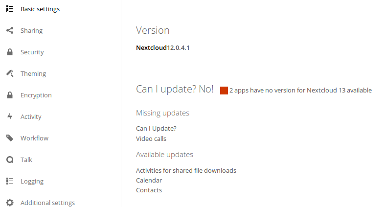

# ⚠️ App "caniupdate" is obsoleted with Nextcloud 14 ⚠️
The functionality of the "caniupdate" app has been merged into the update notifications app for Nextcloud 14. You can savely uninstall and delete the "caniupdate" app, because it does not do anything anymore.

# Can I Update?

Checks whether there is an update for all of your apps available,
so you can run the next major version of Nextcloud.

## Success

> 

## Failure

> 
